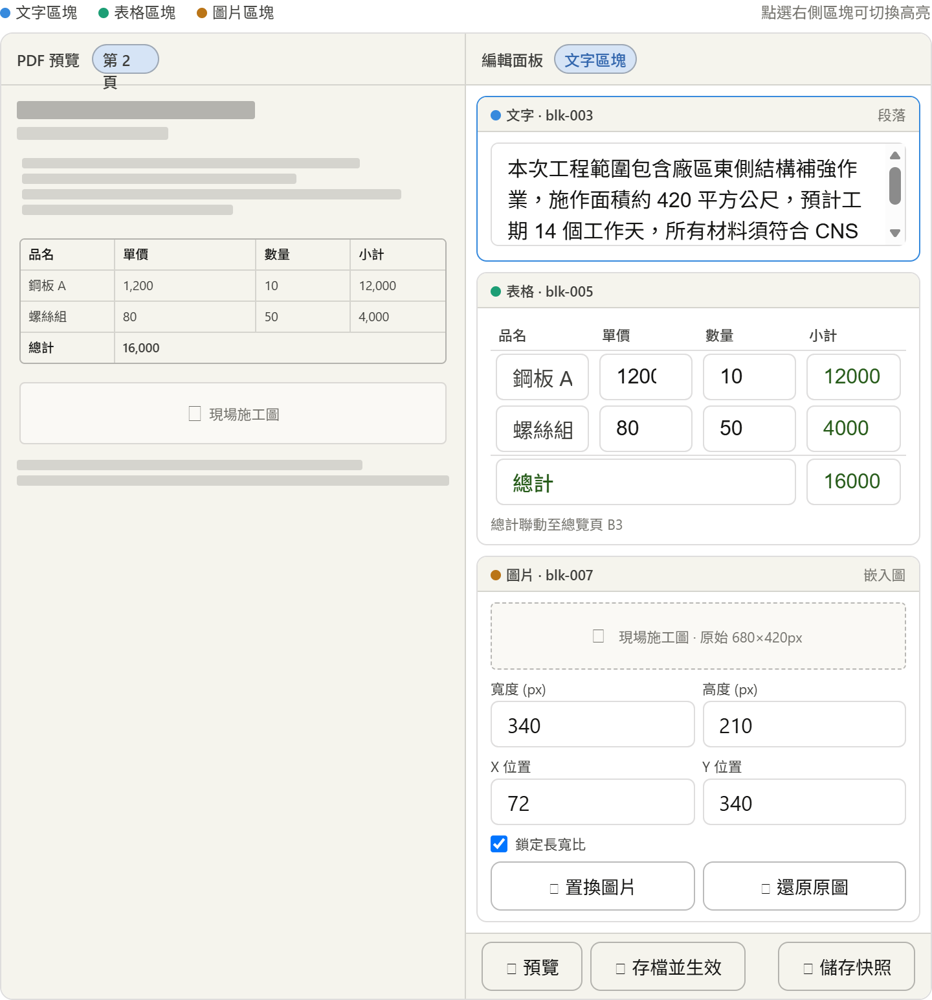
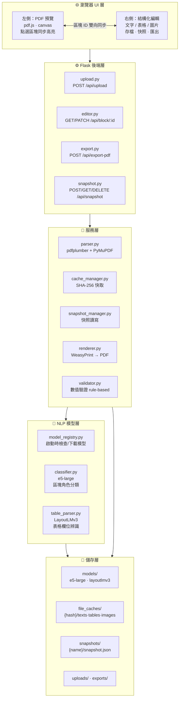
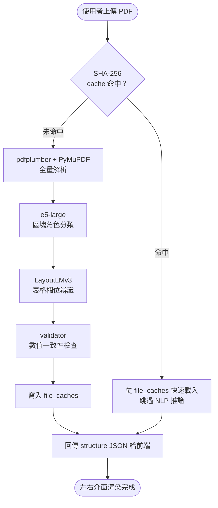
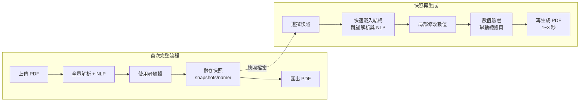
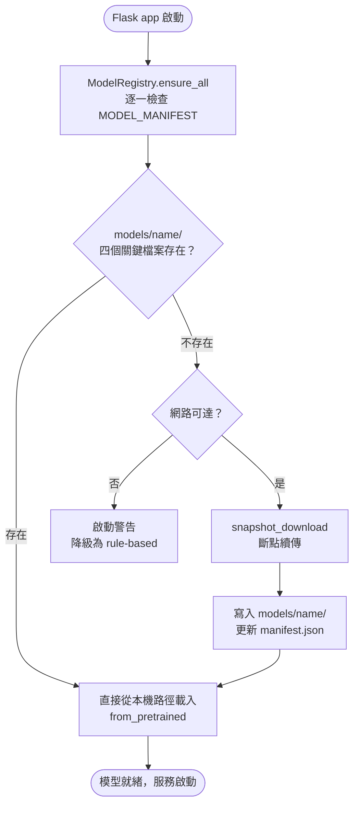

# 📄 PDF 智慧編輯器

> **Flask 後端 · 左右分割介面 · 輕量 NLP 模型 · 快照再生成**
>
> 上傳由 DOCX 轉換的 PDF，自動萃取文字、表格、圖片，在瀏覽器中即時編輯，最終匯出排版還原的 PDF。

---

## ✨ 功能特色

| 功能 | 說明 |
|------|------|
| 📑 **PDF 解析** | pdfplumber + PyMuPDF 擷取文字、表格、圖片與座標 |
| 🧠 **NLP 區塊分類** | multilingual-e5-large-instruct 自動辨識封面、標題、表格、附錄 |
| 📊 **表格語意解析** | LayoutLMv3 辨識項次/品名/單價/數量/小計欄位 |
| ✏️ **統一編輯介面** | 左側 PDF 預覽 ↔ 右側結構化編輯，點選即同步高亮 |
| 🔢 **表格即時重算** | 修改單價/數量，小計與總計自動聯動，總覽頁同步更新 |
| 🖼️ **圖片置換** | 可替換圖片、調整尺寸與位置（支援鎖定長寬比） |
| 💾 **解析快取** | SHA-256 比對，同一份 PDF 第二次開啟跳過 NLP，秒級載入 |
| 📸 **編輯快照** | 儲存完整編輯狀態，下次只需修改數字即可再生成 PDF |
| 🤖 **本機模型管理** | 自動檢查模型是否存在，缺少才下載，離線環境可手動放置 |

---

## ✨ 程式介面



---

## 🗂️ 專案目錄結構

```
pdf-editor/
├── run.py                          # Flask 進入點
├── config.py                       # 環境設定
├── requirements.txt
├── .env
│
├── app/
│   ├── __init__.py                 # create_app()，啟動時呼叫 ModelRegistry
│   ├── extensions.py
│   │
│   ├── routes/
│   │   ├── upload.py               # POST /api/upload
│   │   ├── editor.py               # GET/PATCH /api/block/:id
│   │   ├── export.py               # POST /api/export-pdf
│   │   ├── image.py                # POST /api/replace-image
│   │   └── snapshot.py             # POST/GET/DELETE /api/snapshot
│   │
│   ├── services/
│   │   ├── parser.py               # PDF 解析：pdfplumber + PyMuPDF
│   │   ├── classifier.py           # 區塊分類：e5-large embedding
│   │   ├── table_parser.py         # 表格欄位辨識：LayoutLMv3
│   │   ├── validator.py            # 數值一致性驗證 (rule-based)
│   │   ├── renderer.py             # PDF 輸出：WeasyPrint
│   │   ├── cache_manager.py        # file_caches 讀寫
│   │   ├── snapshot_manager.py     # 快照 save/load/list/delete
│   │   └── model_registry.py       # 模型下載與本機路徑管理
│   │
│   ├── models/
│   │   └── document.py             # Block, TableData, DocumentMeta
│   │
│   ├── static/
│   │   ├── js/
│   │   │   ├── editor.js           # 左右同步、區塊高亮
│   │   │   ├── table_edit.js       # 即時重算、聯動總覽
│   │   │   └── image_edit.js       # 尺寸、位置、置換
│   │   └── css/
│   │       └── editor.css
│   │
│   └── templates/
│       └── index.html
│
├── models/                         # 本機模型快取（不進版控）
│   ├── manifest.json
│   ├── multilingual-e5-large-instruct/
│   └── layoutlmv3-base/
│
├── file_caches/                    # PDF 解析後快取（不進版控）
│   └── {sha256_hash}/
│       ├── meta.json
│       ├── texts.json
│       ├── tables.json
│       ├── structure.json
│       └── images/
│
├── snapshots/                      # 編輯後快照（不進版控）
│   └── {name}/
│       ├── snapshot.json
│       ├── snapshot_meta.json
│       └── images/
│
├── uploads/                        # 原始上傳檔（不進版控）
└── exports/                        # 匯出 PDF（不進版控）
```

---

## 🏗️ 系統架構圖



---

## 🔄 PDF 上傳與解析流程



---

## 📸 快照與再生成流程



---

## 🤖 模型下載流程



---

## 🛠️ 安裝與啟動

### 1. 環境需求

- Python 3.10+
- Git + Git LFS + Git Xet

### 2. 安裝 Git 大檔支援

```bash
git lfs install

# 安裝 git-xet（HuggingFace Xet 格式模型必要）
curl --proto '=https' --tlsv1.2 -sSf \
  https://raw.githubusercontent.com/huggingface/xet-core/refs/heads/main/git_xet/install.sh | sh
git xet install
```

### 3. 複製專案

```bash
git clone https://github.com/kyteon-gif/pdf-editor.git
cd pdf-editor
pip install -r requirements.txt
```

### 4. 下載模型

**方法 A：git clone（取得完整倉庫）**

```bash
cd models
git clone https://huggingface.co/intfloat/multilingual-e5-large-instruct
git clone https://huggingface.co/microsoft/layoutlmv3-base
cd ..
```

**方法 B：huggingface-cli（推薦，可排除冗餘檔案）**

```bash
pip install huggingface_hub hf_xet

# e5-large (~1.12 GB)
huggingface-cli download intfloat/multilingual-e5-large-instruct \
  --local-dir ./models/multilingual-e5-large-instruct

# layoutlmv3-base (~501 MB，排除 .bin 與 .onnx)
huggingface-cli download microsoft/layoutlmv3-base \
  --local-dir ./models/layoutlmv3-base \
  --ignore-patterns "*.bin" "*.onnx"
```

### 5. 啟動

```bash
python run.py
# 開啟瀏覽器：http://localhost:5000
```

---

## 📦 模型清單

| 模型 | 用途 | HuggingFace ID | 大小 | 授權 |
|------|------|---------------|------|------|
| multilingual-e5-large-instruct | 區塊角色分類 | `intfloat/multilingual-e5-large-instruct` | ~1.12 GB | MIT |
| layoutlmv3-base | 表格欄位辨識 | `microsoft/layoutlmv3-base` | ~501 MB | CC-BY-NC-SA 4.0 |

> ⚠️ `layoutlmv3-base` 授權為 **CC-BY-NC-SA 4.0**，**不可用於商業用途**。

---

## 🗄️ 核心資料結構

解析完成後，每份文件以下列 JSON 格式存於 `file_caches/{hash}/`：

```json
{
  "doc_id": "sha256-hash",
  "blocks": [
    {
      "id": "blk-001",
      "type": "heading_1 | body | table | image | cover | overview | appendix",
      "page": 1,
      "bbox": [x0, y0, x1, y1],
      "content": "文字內容",
      "table_data": {
        "headers": ["項次", "品名", "單價", "數量", "小計"],
        "rows": [["1", "鋼板 A", "1200", "10", "12000"]],
        "total": 16000,
        "linked_overview_cell": "B3"
      },
      "image_path": null
    }
  ],
  "overview_table": {
    "formula_links": {
      "blk-005": {"overview_block_id": "blk-002", "cell": "B3"}
    }
  }
}
```

---

## ⚡ 效能比較

| 場景 | 耗時估計 |
|------|---------|
| 首次上傳（全量解析 + NLP） | 10 – 60 秒 |
| 第二次開啟同一份 PDF（cache 命中） | < 1 秒 |
| 從快照再生成 PDF | 1 – 3 秒 |

---

## 📋 API 路由一覽

| 方法 | 路由 | 說明 |
|------|------|------|
| `POST` | `/api/upload` | 上傳 PDF，回傳 doc_id 與結構 JSON |
| `GET` | `/api/block/:doc_id` | 取得文件所有區塊 |
| `PATCH` | `/api/block/:doc_id/:block_id` | 更新單一區塊內容 |
| `POST` | `/api/replace-image` | 更換圖片（含尺寸/位置） |
| `POST` | `/api/export-pdf` | 匯出最終 PDF |
| `POST` | `/api/snapshot` | 儲存當前編輯狀態為快照 |
| `GET` | `/api/snapshots` | 列出所有快照 |
| `GET` | `/api/snapshot/:name` | 載入指定快照 |
| `DELETE` | `/api/snapshot/:name` | 刪除快照 |
| `POST` | `/api/snapshot/:name/regenerate` | 從快照直接再生成 PDF |

---

## 🔧 主要相依套件

```
flask
pdfplumber          # 文字 + 表格擷取
pymupdf             # 圖片擷取 + 高精度渲染
python-docx         # 原始 docx 樣式對照
sentence-transformers  # e5-large 推論
transformers        # LayoutLMv3
weasyprint          # HTML → PDF 輸出
pydantic            # 資料結構驗證
huggingface_hub     # 模型下載
hf_xet              # Xet 格式大檔支援
```

---

## 📁 .gitignore 建議

```gitignore
# 模型與資料目錄不進版控
models/
file_caches/
snapshots/
uploads/
exports/

# Python
__pycache__/
*.pyc
.env
*.egg-info/
dist/
```

---

## 📄 授權

本專案程式碼採用 [MIT License](LICENSE)。

使用的模型授權請參閱各自頁面：
- [multilingual-e5-large-instruct](https://huggingface.co/intfloat/multilingual-e5-large-instruct)（MIT）
- [layoutlmv3-base](https://huggingface.co/microsoft/layoutlmv3-base)（CC-BY-NC-SA 4.0）
